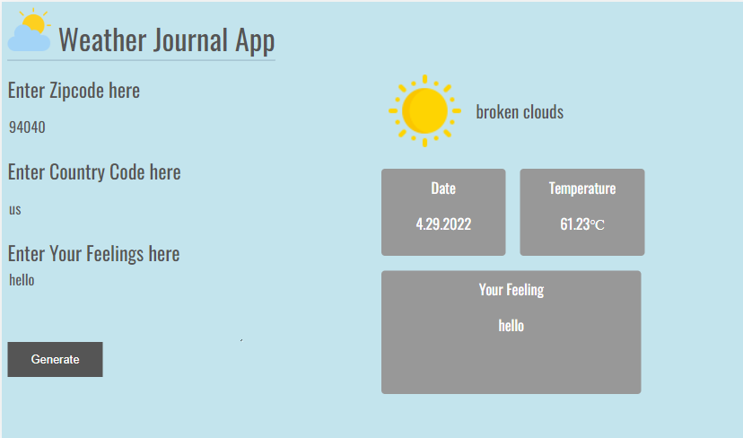

# Weather Journal App
This project is the second project for the professional web development scholarship of FWD Egypt. It requires you to create an asynchronous web app that uses Web API and user data to dynamically update the UI.
## Dependencies
- express
- cors
- body-parser
## APIs
- Fetch from node-fetch
- Current Weather API 2.5 from OpenWeatherMap
- Coordinates by zip/post code from OpenWeatherMap
## App
